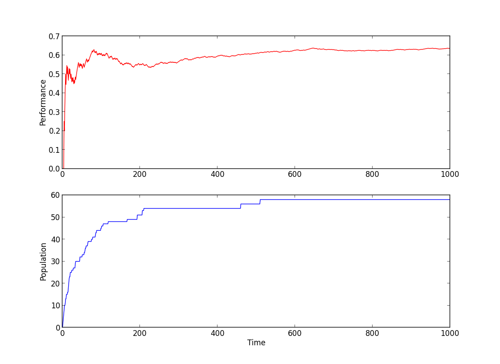

pylcs
=====

A Python interface to [Learning Classifier Systems](http://code.ulb.ac.be/dbfiles/HolBooCol-etal2000lcs.pdf).

Implemented underneath in C++ and integrated via Cython. So it's very fast!

Here is an example solving the 6-multiplexer problem (where the first 2 bits = index of value held in last 4 bits)...




```python
import pylcs
import matplotlib.pyplot as plt
from random import randint

# Define muliplexer 'fitness' function
def multiplex(bits,addrlen=2):
  return bits[int(reduce(lambda x,y: str(y)+str(x),bits[0:addrlen]),base=2)]

# Create classifier by defining the action set [0 or 1]
lcs = pylcs.xcs([0,1])

# Set up to record time, performance and population
t = []; p = []; s = []

# Change the learning rate and exploration probability...
lcs.BETA = 0.015
lcs.EPSILON = 0.1

while True:
  # Record current values as we go
  t.append(lcs.time())
  p.append(lcs.perf())
  s.append(lcs.size())
  # Generate random perception of 6 bits
  percept = [randint(0,1) for b in range(1,6+1)]
  # Determine classifier action based on this
  act = lcs.act(percept)
  # Give reward if action is correct
  if (act==multiplex(percept)):
    lcs.reward(1000)
  # Terminate if run too long or performance good
  if t[-1]>1000 and p[-1]>0.6: 
    break

# Plot results
ax1 = plt.subplot(2,1,1)
plt.plot(t,p,'r-'); plt.ylabel('Performance'); ax1.set_ylim([0,1.0])
ax2 = plt.subplot(2,1,2)
plt.plot(t,s,'b-'); plt.ylabel('Population')
plt.xlabel('Time')
plt.show()
```

Only the [eXtendend Classifier System (XCS)](http://link.springer.com/content/pdf/10.1007/s005000100111.pdf) is currently implemented. The core C++ code follows this paper exactly - so it should form a good basis for documentation and learning how it operates. 

To run, make sure you have cython installed - e.g. `pip install cython`

Then build *in situ* with:

```	
python setup.py build_ext --inplace
```

Or install with:

```
python setup.py install
```

You can run the above example by typing `python test.py`.

This original code was written back in 2002 for my Master's thesis ["Dynamically Developing Novel and Useful Behaviours: a First Step in Animat Creativity"](http://citeseerx.ist.psu.edu/viewdoc/download?doi=10.1.1.10.7447&rep=rep1&type=pdf). 

This code is distributed under the [MIT Licence](LICENCE).

TODO:

Where to start? Well if there was time...

* ~~Fix/test more - especially memory!~~ *Substantially investigated with valgrind in conjunction with multiple runs of test.py on MacOS/clang compiled.* 
* ~~Expose parameter get/set functions.~~
* Show it working on a more "real world" problem!
* Generalise LCS class/interface.
* Implement a strength-based Michigan LCS (e.g. ZCS) 
* Implement a Pittsburgh style LCS (e.g. GALE).
* Implement any number of LCS for different problem/representations (see table 1 of ["Learning Classifier Systems: A Complete Introduction, Review, and Roadmap"](http://www.hindawi.com/archive/2009/736398/abs/)).
